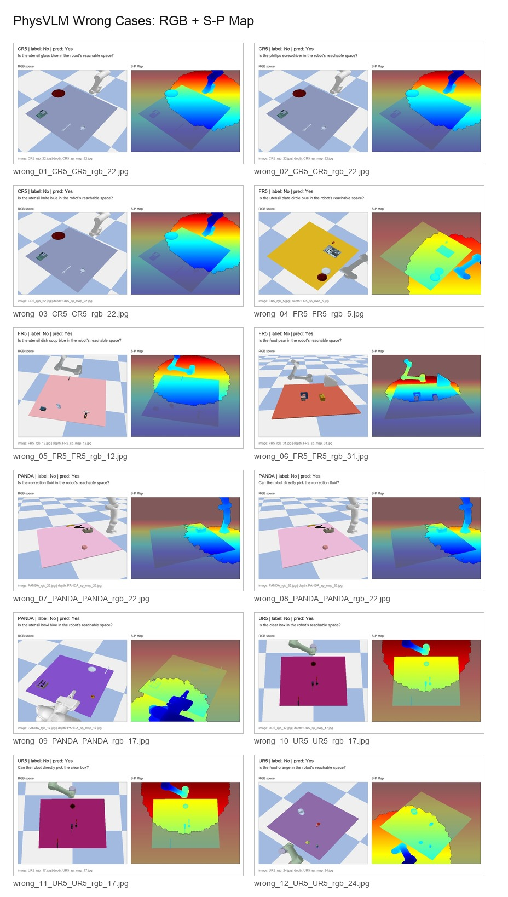
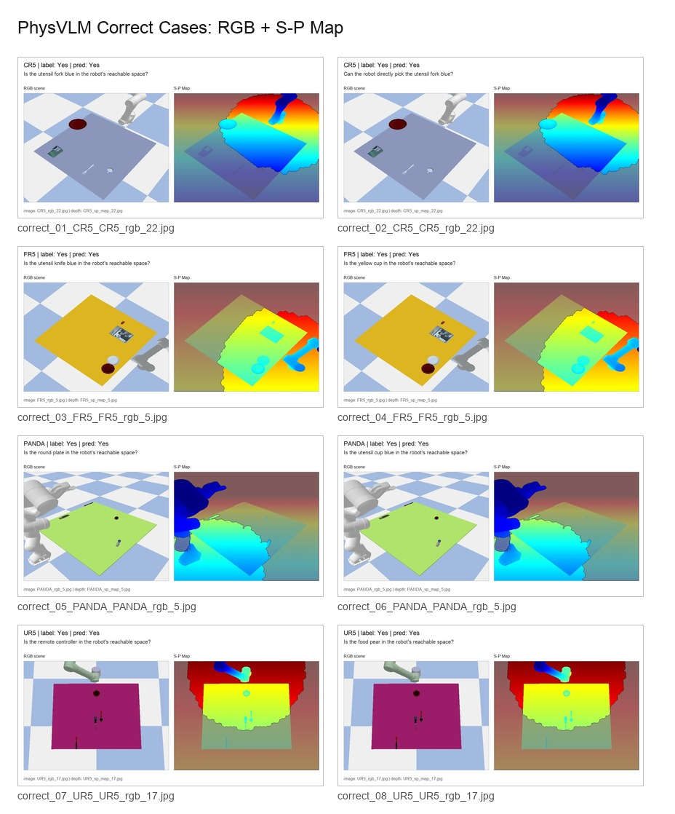

# PhysVLM Reproduction and S-P Map Analysis

Reproducible Colab pipeline and diagnostic analysis for **PhysVLM** robotic physical reachability reasoning.

This project is not a model re-training fork. It turns the released research code into a runnable evaluation workflow, then adds diagnostic analysis around S-P Map usage and reachability errors.

## What Is Different From The Official Repo

- Runs PhysVLM inference without the missing `start_physvlm_server.py` entrypoint.
- Provides a standalone RGB + S-P Map inference script and an offline evaluator.
- Fixes two practical release issues: full checkpoint loading returning `None`, and the released SigLIP tower alias resolving to the public Hugging Face model id.
- Adds Colab-oriented reproduction instructions for checkpoint loading, simulator data generation, and evaluation.
- Adds structured result analysis: per-robot accuracy, question-template accuracy, Yes/No confusion, object-level errors, and RGB/S-P Map visual case studies.
- Adds an S-P Map ablation protocol: aligned S-P Map, black placeholder, and mismatched S-P Map.
- Adds an inference profiling loop for PyTorch latency, throughput, and CUDA peak-memory measurement.

## Pipeline

```text
Colab GPU setup
  -> clone official PhysVLM source and apply compatibility patches
  -> download PhysVLM-Qwen2.5-3B checkpoint
  -> generate EQA-phys simulator scenes and S-P Maps
  -> run standalone inference
  -> run offline evaluation
  -> analyze benchmark, ablation, and error cases
  -> profile inference latency and memory
```

## Current Full Benchmark Result

The current completed run uses the aligned RGB + S-P Map input on the EQA-phys simulator benchmark. It contains 1,600 Yes/No reachability QA examples across four robot platforms and was run on Colab A100 fp16.

| Robot | Correct | Total | Accuracy |
| --- | ---: | ---: | ---: |
| ALL | 1279 | 1600 | 79.94% |
| CR5 | 325 | 400 | 81.25% |
| FR5 | 335 | 400 | 83.75% |
| PANDA | 321 | 400 | 80.25% |
| UR5 | 298 | 400 | 74.50% |

By question template, `direct_pick` questions reached 83.50% accuracy, while `reachable_space` questions reached 76.38%.

## Error Analysis

The main failure mode is a strong **Yes bias**. The model produced 1,291 Yes predictions against 974 Yes labels. Out of 321 total errors, 319 were false positives: label `No`, prediction `Yes`.

| Label | Pred Yes | Pred No |
| --- | ---: | ---: |
| Yes | 972 | 2 |
| No | 319 | 307 |





## S-P Map Ablation Protocol

The evaluator supports three depth modes:

| Mode | Input Policy | Purpose |
| --- | --- | --- |
| `normal` | Use the aligned S-P Map from the QA JSON. | Baseline reproduction. |
| `black` | Keep the `<depth>` token but replace the S-P Map with a black image. | Test performance without physical-space information. |
| `mismatch` | Keep RGB fixed, but use the next scene's S-P Map from the same robot split. | Test sensitivity to incorrect physical context. |

Run a smoke test first:

```bash
python scripts/eval_standalone.py \
  --physvlm-root ../github_repos/PhysVLM/physvlm-main \
  --model-path /path/to/PhysVLM-Qwen2.5-3B \
  --qa-json /path/to/phys_bench_sim_qas.json \
  --data-root /path/to/EQA-phys-simulator \
  --depth-mode black \
  --limit 20 \
  --device cuda \
  --load-4bit \
  --output-json results/physvlm_eval_results_black_limit20.json
```

Then run all three full evaluations:

```bash
for mode in normal black mismatch; do
  python scripts/eval_standalone.py \
    --physvlm-root ../github_repos/PhysVLM/physvlm-main \
    --model-path /path/to/PhysVLM-Qwen2.5-3B \
    --qa-json /path/to/phys_bench_sim_qas.json \
    --data-root /path/to/EQA-phys-simulator \
    --depth-mode "$mode" \
    --device cuda \
    --load-4bit \
    --output-json "results/physvlm_eval_results_${mode}_full.json"
done
```

Generate the ablation report:

```bash
python scripts/analyze_ablation.py \
  --normal-json results/physvlm_eval_results_normal_full.json \
  --black-json results/physvlm_eval_results_black_full.json \
  --mismatch-json results/physvlm_eval_results_mismatch_full.json \
  --output-dir results/ablation
```

Expected outputs:

- `ablation_summary.csv`
- `ablation_confusion.csv`
- `ablation_by_robot.csv`
- `ablation_by_question_type.csv`
- `ablation_report.md`

## S-P Map Ablation Results

The ablation run compares aligned physical context against two degraded depth inputs.

| Depth Mode | Correct | Total | Accuracy |
| --- | ---: | ---: | ---: |
| `normal` | 1279 | 1600 | 79.94% |
| `black` | 1239 | 1600 | 77.44% |
| `mismatch` | 1270 | 1600 | 79.37% |

The black-depth setting drops by 2.50 percentage points, which suggests that the S-P Map contributes useful physical information. The mismatched S-P Map only drops by 0.57 percentage points, so the conclusion is deliberately conservative: PhysVLM uses S-P context, but the current setup still shows a strong RGB/language prior and persistent Yes-bias.

| Depth Mode | False Positive (No -> Yes) | False Negative (Yes -> No) |
| --- | ---: | ---: |
| `normal` | 319 | 2 |
| `black` | 360 | 1 |
| `mismatch` | 327 | 3 |

## Inference Profiling

This project keeps deployment work scoped to a reliable PyTorch profiling loop. It does not claim an ONNX or TensorRT export. The profiler measures end-to-end single-sample inference through `PhysVLMPredictor.predict()`, including image loading, RGB/S-P preprocessing, prompt tokenization, and `model.generate()`.

Run a 50-sample profiling pass:

```bash
python scripts/benchmark_inference.py \
  --physvlm-root ../github_repos/PhysVLM/physvlm-main \
  --model-path /path/to/PhysVLM-Qwen2.5-3B \
  --qa-json /path/to/phys_bench_sim_qas.json \
  --data-root /path/to/EQA-phys-simulator \
  --depth-mode normal \
  --limit 50 \
  --device cuda \
  --load-4bit \
  --output-json results/profile_normal_50.json \
  --output-md results/profile_normal_50.md
```

The profiling report includes mean/median/P90 latency, examples per second, generated tokens per second, and peak CUDA memory.

Current profiling result on Colab A100 fp16, 50 normal-mode examples:

| Metric | Value |
| --- | ---: |
| Mean latency | 165.274 ms |
| Median latency | 155.228 ms |
| P90 latency | 161.754 ms |
| Examples / second | 6.0505 |
| Generated tokens / second | 6.0505 |
| Peak CUDA memory | 8.41 GB |

## Files

- `notebooks/01_colab_pro_reproduction.ipynb`: self-contained Colab Pro runbook.
- `scripts/standalone_inference.py`: direct RGB + S-P/depth map inference.
- `scripts/eval_standalone.py`: offline EQA-phys evaluation with `normal / black / mismatch` depth modes.
- `scripts/analyze_ablation.py`: compare the three ablation result JSONs and generate CSV/Markdown reports.
- `scripts/benchmark_inference.py`: profile PyTorch inference latency, throughput, and memory.
- `results/analysis/`: lightweight benchmark summaries and error analysis.
- `results/ablation/`: S-P Map ablation CSVs and Markdown report.
- `results/profiling/`: PyTorch inference profiling JSON and Markdown report.
- `results/visualization/`: selected RGB + S-P Map visual case studies.

## Lightweight Result Artifacts

Tracked result artifacts are intentionally small:

- `results/analysis/metrics_summary.csv`
- `results/analysis/question_type_summary.csv`
- `results/analysis/confusion_by_robot.csv`
- `results/analysis/prediction_distribution.csv`
- `results/analysis/wrong_cases_top50.csv`
- `results/analysis/object_error_summary.csv`
- `results/analysis/summary.md`
- `results/analysis/resume_blurb.md`
- `results/ablation/ablation_report.md`
- `results/profiling/physvlm_profile_normal_50.md`
- `results/visualization/wrong_cases_contact_sheet.jpg`
- `results/visualization/correct_cases_contact_sheet.jpg`
- selected wrong/correct visual case images

The repository does not track model weights, full simulator images, raw Colab archives, or complete generated datasets.

## Notes And Limitations

- This project does not retrain PhysVLM or claim a new model.
- The primary contribution is reproducible engineering, ablation tooling, and diagnostic analysis.
- Full `black` and `mismatch` ablations require Colab/Kaggle GPU or another CUDA machine capable of loading PhysVLM-Qwen2.5-3B.
- Inference profiling is PyTorch-only in v1; ONNX Runtime and TensorRT are intentionally scoped as future deployment experiments.
- v1 intentionally does not include a generic VLM baseline; Qwen2-VL or InternVL baselines are left for a future extension.
