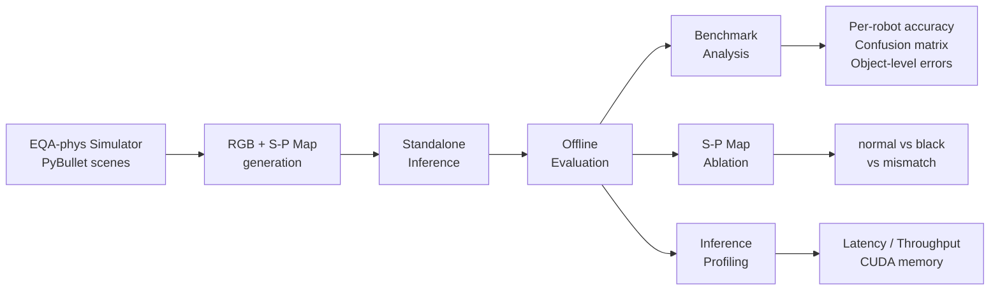

# PhysVLM Reproduction & S-P Map Ablation Analysis

[](notebooks/01_colab_pro_reproduction.ipynb)
[](notebooks/02_colab_v2_deployment.ipynb)


> Reproducible evaluation pipeline and diagnostic ablation study for **PhysVLM** robotic physical reachability reasoning, built on the EQA-phys simulator benchmark.

**PhysVLM** (CVPR 2025) is a vision-language model that takes an RGB image and a Spatial-Physical Map (S-P Map) as dual-channel input to reason about whether a robot arm can physically reach a target object. This project reproduces the evaluation, designs ablation experiments to probe how much the model actually relies on S-P Map information, and provides structured error analysis.

## Motivation

The official PhysVLM release is research-oriented and lacks a turnkey evaluation path: the server entrypoint (`start_physvlm_server.py`) is missing, and full-checkpoint loading can silently return `None`. This project addresses those gaps and goes further by asking: **does PhysVLM genuinely use the S-P Map, or does it rely primarily on RGB and language priors?**

## Pipeline



## What Is Different From The Official Repo

- **Standalone inference**: bypasses the missing server entrypoint with a direct `PhysVLMPredictor` class.
- **Compatibility fixes**: handles full-checkpoint loading returning `None` and resolves the released SigLIP tower alias to the correct Hugging Face model id.
- **Offline evaluator**: batch evaluation over the full EQA-phys benchmark with structured JSON output.
- **S-P Map ablation protocol**: three depth modes (`normal` / `black` / `mismatch`) to isolate the contribution of spatial-physical information.
- **Error analysis**: per-robot accuracy, question-type breakdown, Yes/No confusion matrices, and object-level error rates.
- **Inference profiling**: end-to-end PyTorch latency, throughput, and CUDA peak-memory measurement.

## Benchmark Results

Full evaluation on 1,600 Yes/No reachability QA examples across four robot platforms (Colab A100, fp16):

| Robot | Correct | Total | Accuracy |
| :--- | ---: | ---: | ---: |
| **ALL** | **1,279** | **1,600** | **79.94%** |
| CR5 | 325 | 400 | 81.25% |
| FR5 | 335 | 400 | 83.75% |
| PANDA | 321 | 400 | 80.25% |
| UR5 | 298 | 400 | 74.50% |

By question template: `direct_pick` reached 83.50%, `reachable_space` reached 76.38%.

## S-P Map Ablation

The core diagnostic question: **does the model use S-P Map information, or is it just relying on RGB and language cues?**

| Mode | Description | Accuracy | Delta |
| :--- | :--- | ---: | ---: |
| `normal` | Aligned RGB + S-P Map | 79.94% | baseline |
| `black` | S-P Map replaced with black image | 77.44% | -2.50 pp |
| `mismatch` | S-P Map from a different scene | 79.37% | -0.57 pp |

**Key findings:**

1. **S-P Map provides useful signal** -- removing it (`black`) drops accuracy by 2.50 percentage points.
2. **RGB/language prior dominance** -- using a *wrong* S-P Map (`mismatch`) only drops 0.57 pp, indicating the model still relies heavily on visual and linguistic cues rather than fine-grained spatial reasoning.
3. **Persistent Yes-bias across all modes** -- the error direction table below shows false positives dominate regardless of S-P Map quality:

| Mode | False Positive (No->Yes) | False Negative (Yes->No) |
| :--- | ---: | ---: |
| `normal` | 319 | 2 |
| `black` | 360 | 1 |
| `mismatch` | 327 | 3 |

## Error Analysis

The dominant failure mode is a strong **Yes-bias**: out of 321 total errors in normal mode, 319 are false positives (label `No`, prediction `Yes`). The model almost never predicts `No` when the answer is `Yes`, but frequently overestimates reachability for unreachable objects.

| Label \ Prediction | Yes | No |
| :--- | ---: | ---: |
| Yes | 972 | 2 |
| No | 319 | 307 |

<p align="center">
  
  <br/>
  <em>Selected false-positive cases across four robot platforms</em>
</p>

<p align="center">
  
  <br/>
  <em>Selected correctly classified cases</em>
</p>

## Inference Profiling

PyTorch end-to-end profiling on Colab A100 (fp16, 50 examples):

| Metric | Value |
| :--- | ---: |
| Mean latency | 165.3 ms |
| Median latency | 155.2 ms |
| P90 latency | 161.8 ms |
| Throughput | 6.05 examples/s |
| Peak CUDA memory | 8.41 GB |

## Deployment Optimization

V2 adds a deployment-aware benchmark loop while keeping PyTorch fp16 as the end-to-end functional baseline. The goal is to measure what can be accelerated honestly, not to claim a full TensorRT conversion of the VLM decoding path without evidence.

| Backend / Path | Scope | Script |
| :--- | :--- | :--- |
| PyTorch fp16 | Full `model.generate()` answer path | `scripts/benchmark_inference.py` |
| `torch.compile` | Full `model.generate()` answer path, with graph-break notes when compilation is partial | `scripts/benchmark_torch_compile.py` |
| ONNX Runtime CUDA | Exportable submodules such as `vision_tower` and `mm_projector` | `scripts/export_onnx_modules.py`, `scripts/check_export_parity.py`, `scripts/benchmark_onnx.py` |
| TensorRT EP | ONNX Runtime TensorRT Execution Provider feasibility for exported submodules | `scripts/benchmark_tensorrt_ep.py` |
| FastAPI | Online serving wrapper and request-level latency benchmark | `scripts/serve_physvlm.py`, `scripts/benchmark_api.py` |

The full VLM generation path has known deployment boundaries: autoregressive `generate()` includes dynamic decoding, tokenizer interactions, custom multimodal inputs, cache updates, and model-specific control flow. V2 therefore reports API and PyTorch full-path latency separately from ONNX/TensorRT submodule latency. Use [02_colab_v2_deployment.ipynb](notebooks/02_colab_v2_deployment.ipynb) to run the deployment tests, and see [deployment_report.md](results/deployment/deployment_report.md) for the result schema.

V2 Colab A100 results:

| Backend | Scope | Status | Mean latency | Throughput |
| :--- | :--- | :--- | ---: | ---: |
| `torch.compile` | Full `generate()` | completed, not a reliable speedup due to graph breaks | 3443.1 ms | 0.29/s |
| ONNX Runtime CUDA | `vision_tower` | success, cosine parity 0.99998 | 14.7 ms | 68.25/s |
| ONNX Runtime CUDA | `mm_projector` | success, cosine parity 0.999999 | 0.85 ms | 1175.96/s |
| TensorRT EP | `vision_tower` | failed: missing `libnvinfer.so.10`; CUDA fallback not counted as TRT | n/a | n/a |

## Project Structure

```
PhysVLM-reproduce/
  scripts/
    standalone_inference.py   # PhysVLMPredictor: direct RGB + S-P Map inference
    eval_standalone.py        # Offline evaluator with normal/black/mismatch modes
    analyze_ablation.py       # Ablation CSV + Markdown report generator
    benchmark_inference.py    # Latency / throughput / memory profiler
    benchmark_torch_compile.py # torch.compile full-path benchmark attempt
    export_onnx_modules.py     # ONNX export for deployment submodules
    check_export_parity.py     # PyTorch vs ONNX output consistency check
    benchmark_onnx.py          # ONNX Runtime CUDA submodule benchmark
    benchmark_tensorrt_ep.py   # ONNX Runtime TensorRT EP feasibility benchmark
    serve_physvlm.py           # FastAPI serving wrapper
    benchmark_api.py           # API request-level benchmark
  notebooks/
    01_colab_pro_reproduction.ipynb  # Self-contained Colab reproduction runbook
    02_colab_v2_deployment.ipynb     # V2 deployment benchmark runbook
  results/
    analysis/                 # Benchmark summaries, confusion tables, error analysis
    ablation/                 # S-P Map ablation tables and report
    profiling/                # Inference profiling JSON and report
    deployment/               # Deployment runbook, summary schema, backend JSON outputs
      onnx_metadata/          # Lightweight ONNX export metadata, not ONNX model files
    visualization/            # RGB + S-P Map visual case studies
```

## Quick Start

**1. Clone and install dependencies:**

```bash
git clone https://github.com/Xxc33128/PhysVLM-reproduce.git
cd PhysVLM-reproduce
pip install -r requirements.txt
```

**2. Run evaluation (example with black ablation):**

```bash
python scripts/eval_standalone.py \
  --physvlm-root /path/to/PhysVLM/physvlm-main \
  --model-path /path/to/PhysVLM-Qwen2.5-3B \
  --qa-json /path/to/phys_bench_sim_qas.json \
  --data-root /path/to/EQA-phys-simulator \
  --depth-mode black \
  --device cuda --load-4bit \
  --output-json results/eval_black.json
```

**3. Generate ablation report:**

```bash
python scripts/analyze_ablation.py \
  --normal-json results/eval_normal.json \
  --black-json results/eval_black.json \
  --mismatch-json results/eval_mismatch.json \
  --output-dir results/ablation
```

**4. Profile inference:**

```bash
python scripts/benchmark_inference.py \
  --physvlm-root /path/to/PhysVLM/physvlm-main \
  --model-path /path/to/PhysVLM-Qwen2.5-3B \
  --qa-json /path/to/phys_bench_sim_qas.json \
  --data-root /path/to/EQA-phys-simulator \
  --limit 50 --device cuda --load-4bit \
  --output-json results/profile.json --output-md results/profile.md
```

**5. Run deployment smoke tests on Colab A100:**

```bash
pip install onnx onnxruntime-gpu fastapi uvicorn pydantic

export PHYSVLM_ROOT=/path/to/PhysVLM/physvlm-main
export PHYSVLM_MODEL_PATH=/path/to/PhysVLM-Qwen2.5-3B
export PHYSVLM_QA_JSON=/path/to/phys_bench_sim_qas.json
export PHYSVLM_DATA_ROOT=/path/to/EQA-phys-simulator

python scripts/benchmark_torch_compile.py --limit 5
python scripts/export_onnx_modules.py --module vision_tower
python scripts/check_export_parity.py --module vision_tower
python scripts/benchmark_onnx.py --module vision_tower --limit 5
python scripts/benchmark_tensorrt_ep.py --module vision_tower --limit 5
```

To benchmark online serving, start the API in one terminal and run the client benchmark in another:

```bash
python scripts/serve_physvlm.py --host 0.0.0.0 --port 8000
python scripts/benchmark_api.py --limit 5 --base-url http://127.0.0.1:8000
```

For the full step-by-step walkthrough including checkpoint download and simulator data generation, see the [Colab notebook](notebooks/01_colab_pro_reproduction.ipynb).

## Limitations

- This project does **not** retrain PhysVLM or propose a new model. The contribution is reproducible engineering, ablation tooling, and diagnostic analysis.
- ONNX Runtime benchmarking is scoped to exportable submodules unless the full `generate()` path is explicitly exported and tested.
- TensorRT EP was attempted, but the Colab runtime lacked `libnvinfer.so.10`; CUDA fallback latency is recorded separately and is not claimed as TensorRT latency.
- v1 does not include a generic VLM baseline (e.g., Qwen2-VL or InternVL); this is planned as a future extension.

## Acknowledgements

This project builds on [PhysVLM](https://github.com/unira-zwj/PhysVLM) by Weijie Zhu et al. (CVPR 2025) and uses the [EQA-phys simulator](https://github.com/unira-zwj/PhysVLM/tree/main/EQA-phys-simulator) for benchmark data generation.
